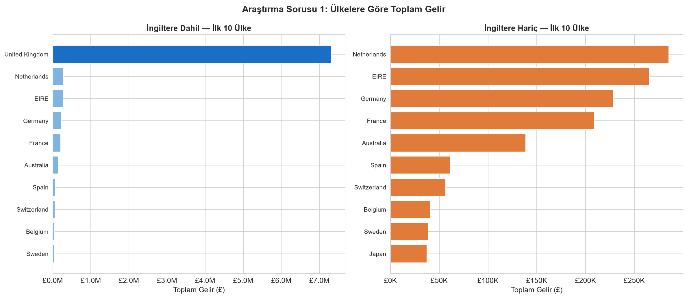
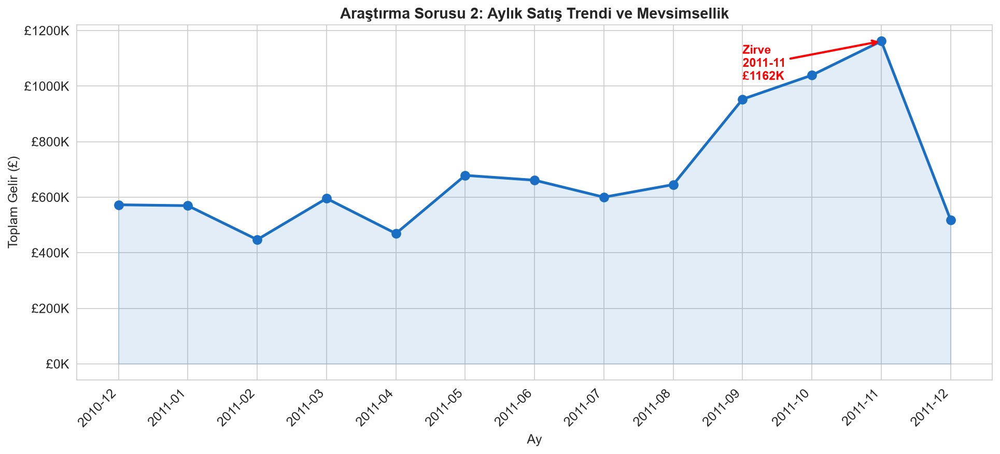
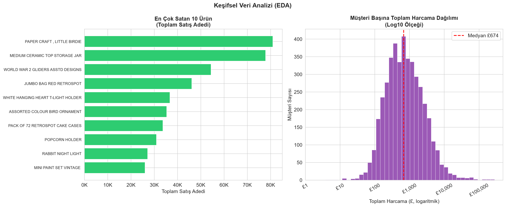
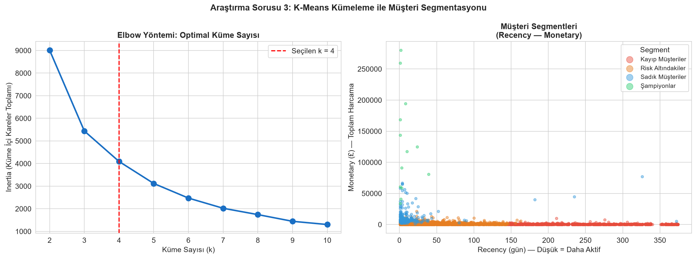

# Online Retail Veri Seti ile Müşteri Segmentasyonu: RFM Analizi ve K-Means Kümeleme

**Ders:** Veri Bilimi  
**Tarih:** 28 Haziran 2026  
**Veri Kaynağı:** UCI Machine Learning Repository — Online Retail Dataset  
**Yöntem:** RFM Analizi + K-Means Kümeleme

---

## 1. Problem Tanımı

E-ticaret sektöründe müşteri davranışını anlamak, işletmelerin pazarlama bütçelerini verimli kullanabilmesinin temel koşuludur. Her müşteriye aynı kampanyayı göndermek hem maliyetli hem de etkisizdir: yüksek değerli müşteriler ilgi beklerken, kaybolma riski taşıyan müşteriler fark edilmeden ayrılabilir. Bu nedenle müşteri tabanını anlamlı gruplara ayırmak — segmentasyon — modern veri odaklı pazarlamanın merkezinde yer almaktadır.

Bu çalışmada RFM (Recency, Frequency, Monetary) analizi kullanılmıştır. RFM, her müşteri için üç boyutlu bir profil oluşturur: ne kadar yakın zamanda alışveriş yaptı, ne sıklıkla alışveriş yaptı ve toplamda ne kadar harcadı. Bu metrikler, makine öğrenmesi algoritmaları için güçlü bir özellik uzayı oluşturur ve iş dünyasında doğrudan yorumlanabilir sonuçlar üretir.

Çalışmanın yanıt aradığı üç araştırma sorusu şunlardır:

1. **Hangi ülkeler en yüksek geliri sağlamaktadır?** Pazarlama yatırımlarının coğrafi dağılımını anlamak.
2. **Aylık satış trendi nasıldır, mevsimsellik var mıdır?** Stok ve kampanya planlaması için dönemsel kalıpları tespit etmek.
3. **Müşteriler RFM'e göre kaç anlamlı segmente ayrılmaktadır ve bu segmentlerin özellikleri nelerdir?** Kişiselleştirilmiş pazarlama stratejileri için müşteri profilleri oluşturmak.

---

## 2. Veri Seti ve Kaynağı

**Kaynak:** UCI Machine Learning Repository — *Online Retail Data Set*  
Chen, D. (2015). Online Retail [Dataset]. UCI Machine Learning Repository. https://doi.org/10.24432/C5BW33

Veri seti, Birleşik Krallık merkezli ve çevrimiçi satış yapan kayıtlı bir toptancının 01 Aralık 2010 — 09 Aralık 2011 tarihleri arasındaki (yaklaşık 13 aylık) tüm işlem kayıtlarını kapsamaktadır. Veri seti, akademik amaçlarla kamuya açık olarak paylaşılmış olup UCI ML Repository'nin kullanım koşulları çerçevesinde serbestçe kullanılabilir.

**Ham Veri Özeti:**

| Özellik | Değer |
|---|---|
| Satır Sayısı | 541.909 |
| Sütun Sayısı | 8 |
| Tarih Aralığı | 01.12.2010 — 09.12.2011 |

**Sütun Açıklamaları:**

| Sütun | Tür | Açıklama |
|---|---|---|
| `InvoiceNo` | Kategorik | Fatura numarası; "C" ile başlayanlar iptal kaydıdır |
| `StockCode` | Kategorik | Ürün kodu |
| `Description` | Metin | Ürün adı |
| `Quantity` | Sayısal | Satılan adet (negatif değerler iade gösterir) |
| `InvoiceDate` | Tarih/Saat | Fatura tarihi ve saati |
| `UnitPrice` | Sayısal | Birim fiyat (£) |
| `CustomerID` | Sayısal | Benzersiz müşteri kimliği (%24,9 oranında eksik) |
| `Country` | Kategorik | Müşterinin bulunduğu ülke |

---

## 3. Yöntem

### 3.1 Veri Temizleme Stratejisi

Ham verinin doğrudan kullanılması, analizi önemli ölçüde bozabilecek çeşitli sorunlar barındırmaktadır. Bu nedenle aşağıdaki temizleme adımları sırasıyla uygulanmıştır:

1. **`CustomerID` eksik satırların silinmesi:** RFM hesabı için müşteri kimliği zorunludur. 135.080 satır (%24,9) bu nedenle çıkarılmıştır.
2. **İptal faturalarının silinmesi:** `InvoiceNo` değeri "C" ile başlayan 8.905 satır (iade/iptal kaydı) veri setinden çıkarılmıştır.
3. **Geçersiz `UnitPrice` değerlerinin silinmesi:** Sıfır veya negatif birim fiyata sahip 40 satır (hediye, test veya muhasebe düzeltmesi kalemleri) çıkarılmıştır.

Bu adımlar sonucunda **397.884 satır** temiz veri elde edilmiş; analize dahil edilen **4.338 benzersiz müşteri** ve **3.665 benzersiz ürün** belirlenmiştir. Kaldırılan toplam 143.985 satır, ham verinin %26,6'sını oluşturmaktadır.

### 3.2 EDA Görselleştirme Tercihleri

Keşifsel Veri Analizi (EDA) sürecinde dört farklı görsel türü kullanılmıştır:

- **Yatay çubuk grafik (iki panel):** Ülke gelirleri karşılaştırması. İngiltere'nin baskın ağırlığı nedeniyle sol panelde İngiltere dahil, sağ panelde İngiltere hariç ilk 10 ülke gösterilmiştir.
- **Çizgi grafik + dolgu alanı:** Aylık satış trendi. Zirve ay otomatik tespit edilerek kırmızı okla işaretlenmiştir.
- **Yatay çubuk grafik:** En çok satılan 10 ürün, satış adedi bazında.
- **Log10 histogram:** Müşteri başına toplam harcama dağılımı. Verinin yoğun sağ çarpıklığını okunabilir kılmak için logaritmik dönüşüm uygulanmıştır.

### 3.3 RFM Hesaplama Yöntemi

Referans tarihi olarak veri setindeki son işlem tarihinin (09.12.2011) bir gün sonrası seçilmiştir (10.12.2011). Her müşteri için:

- **Recency:** Referans tarihinden müşterinin son fatura tarihini çıkararak elde edilen gün sayısı. Düşük değer, müşterinin daha yakın zamanda alışveriş yaptığını gösterir.
- **Frequency:** Müşterinin benzersiz fatura sayısı. Aynı günkü birden fazla fatura ayrı sayılmıştır.
- **Monetary:** Müşterinin geçerli işlemlerdeki toplam harcaması (£).

### 3.4 K-Means Kümeleme ve Elbow Yöntemi

K-Means algoritması seçilmiştir çünkü (a) yorumlanabilir, küresel kümeler üretir, (b) RFM gibi sayısal özellik uzaylarında etkin çalışır ve (c) iş dünyasında yaygın biçimde kullanılan bir standarttır. Algoritma Euclidean mesafeye dayandığından, farklı ölçekteki RFM değerlerinin kümelemeyi çarpıtmaması için `StandardScaler` ile standartlaştırma uygulanmıştır.

Optimal küme sayısını belirlemek için k=2'den k=10'a kadar her değer için küme içi kareler toplamı (inertia) hesaplanmış ve Elbow grafiği oluşturulmuştur (bkz. Şekil 4). Elbow noktası k=4'te gözlemlenmiştir: k=3'ten k=4'e geçişte inertia 5.439'dan 4.092'ye (%24,7) düşerken, k=4'ten k=5'e geçişte düşüş yalnızca %23,8'dir ve iş yorumlaması açısından anlamlı bir dördüncü segment ortaya çıkmaktadır. Tekrarlanabilirlik için `random_state=42` kullanılmıştır.

### 3.5 Kullanılan Kütüphaneler

| Kütüphane | Sürüm | Kullanım Amacı |
|---|---|---|
| `pandas` | — | Veri yükleme, temizleme, gruplandırma |
| `numpy` | — | Sayısal hesaplamalar |
| `matplotlib` | — | Temel grafik çizimi |
| `seaborn` | — | Grafik stili |
| `scikit-learn` | — | `StandardScaler`, `KMeans` |
| `nbformat` | — | Notebook üretimi (geliştirme aşamasında) |

---

## 4. Bulgular

### 4.1 Araştırma Sorusu 1: Hangi Ülkeler En Yüksek Geliri Sağlamaktadır?

Şekil 1'de görüldüğü üzere, temizlenmiş veriden elde edilen toplam gelir **£8.911.408**'dir.

| Sıra | Ülke | Gelir (£) | Pay (%) |
|---|---|---|---|
| 1 | Birleşik Krallık | 7.308.392 | %82,0 |
| 2 | Hollanda | 285.446 | %3,2 |
| 3 | İrlanda (EIRE) | 265.546 | %3,0 |
| 4 | Almanya | 228.867 | %2,6 |
| 5 | Fransa | 209.024 | %2,3 |
| 6 | Avustralya | 138.521 | %1,6 |

**Bulgu:** Birleşik Krallık, toplam gelirin %82'sini tek başına oluşturmaktadır. Kalan tüm ülkelerin toplamı yalnızca %18'e karşılık gelir. Bu asimetri, şirketin esasen bir yerel/bölgesel işletme olduğunu ve uluslararası satışlarının henüz olgunlaşmamış olduğunu göstermektedir. Hollanda ve İrlanda, birbirinden bağımsız olarak ikinci ve üçüncü sırada yer almakta; Kıta Avrupası pazarında Almanya ve Fransa'nın öne çıktığı görülmektedir.

*Şekil 1: Solda İngiltere dahil, sağda İngiltere hariç ilk 10 ülkenin toplam gelirine göre sıralanmış yatay çubuk grafiği.*

### 4.2 Araştırma Sorusu 2: Aylık Satış Trendi ve Mevsimsellik

Şekil 2'de 13 aylık aylık ciro trendi gösterilmektedir. Aralık 2010'da başlayan dönemin tamamı incelendiğinde belirgin bir yıl sonu mevsimselliği dikkat çekmektedir.

**Öne çıkan veriler:**

- **En yüksek ay:** Kasım 2011 — **£1.161.817**
- **En düşük ay:** Şubat 2011 — **£447.137**
- **Ekim–Aralık 2011 aylık ortalama:** £906.443
- **Diğer aylar aylık ortalama:** £619.208
- **Mevsimsel artış katsayısı:** **1,46×**

Yılın ilk yarısında (Ocak–Temmuz) ciro görece düz seyrederken, Ağustos 2011'den itibaren belirgin bir tırmanış başlamış; Eylül 2011'de £952.838'e, Ekim 2011'de £1.039.319'a ve Kasım 2011'de zirveye ulaşmıştır. Aralık 2011'deki düşüş (%55,4) ise veri setinin ay ortasında (9 Aralık) kesilmesinden kaynaklanmaktadır; bu durum bir mevsimsel düşüşü değil, veri eksikliğini yansıtmaktadır.

Bu bulgu, şirketin yılın son çeyreğinde —özellikle Noel ve yılbaşı hediye alışverişine denk gelen dönemde— ciddi bir talep artışı yaşadığını göstermektedir.

*Şekil 2: Aralık 2010 — Aralık 2011 aylık ciro çizgi grafiği; Kasım 2011 zirvesi kırmızı okla işaretlenmiştir.*

*Şekil 3: Sol: En çok satan 10 ürün (satış adedi bazında). Sağ: Müşteri başına toplam harcama dağılımı (Log10 ölçeği, kırmızı kesikli çizgi medyanı göstermektedir).*

### 4.3 Araştırma Sorusu 3: Müşteri Segmentleri

4.338 müşteriye uygulanan K-Means kümeleme (k=4) sonucunda dört anlamlı segment elde edilmiştir. Şekil 4'te Elbow grafiği ve segment dağılımı görselleştirilmektedir.

**RFM Genel Profili:** Ortalama recency 92,5 gün, medyan 51 gündür; ortalama monetary £2.054, medyan ise £675'tir. Median ile ortalama arasındaki büyük fark, birkaç yüksek değerli müşterinin ortalamayı yukarı çektiğini göstermektedir.

| Segment | Müşteri Sayısı | Ort. Recency | Ort. Frequency | Ort. Monetary |
|---|---|---|---|---|
| Şampiyonlar | 13 | 7 gün | 82,5 fatura | £127.338 |
| Sadık Müşteriler | 204 | 16 gün | 22,3 fatura | £12.709 |
| Risk Altındakiler | 3.054 | 44 gün | 3,7 fatura | £1.359 |
| Kayıp Müşteriler | 1.067 | 248 gün | 1,6 fatura | £481 |

**Şampiyonlar (n=13, %0,3):** Son alışverişlerini medyan 2 gün önce yapmış, ortalama 82,5 farklı fatura kesen ve toplamda ortalama £127.338 harcayan bu grup, müşteri tabanının küçük ama son derece değerli bir segmentidir. 13 müşteri, toplam gelirin orantısız biçimde büyük bir kısmını oluşturmaktadır.

**Sadık Müşteriler (n=204, %4,7):** Son alışverişlerini ortalama 16 gün önce gerçekleştiren, sık satın alan ve önemli harcama seviyeleri olan bu segment, şirketin sağlıklı bir müşteri ilişkisi yönetimi için odaklanması gereken birincil gruptur.

**Risk Altındakiler (n=3.054, %70,4):** Müşteri tabanının büyük çoğunluğunu oluşturan bu segment, düşük frekans (ort. 3,7 fatura) ve ılımlı recency (ort. 44 gün) ile karakterizedir. Bu müşteriler henüz aktifken elde tutulmalıdır; aksi takdirde Kayıp Müşteriler segmentine kayabilirler.

**Kayıp Müşteriler (n=1.067, %24,6):** Son alışverişlerinin üzerinden ortalama 248 gün (yaklaşık 8 ay) geçmiş ve son derece düşük harcamalı bu grup büyük olasılıkla kaybedilmiştir. Geri kazanım maliyeti yüksek olduğundan yalnızca son şans kampanyalarıyla hedeflenmesi önerilir.

*Şekil 4: Sol: k=2–10 için Elbow grafiği (kırmızı kesikli çizgi seçilen k=4'ü göstermektedir). Sağ: Recency–Monetary ekseninde dört müşteri segmentinin renk kodlu dağılımı.*

---

## 5. Sınırlamalar

**Coğrafi yoğunlaşma:** Veri setinin %82'si Birleşik Krallık işlemlerinden oluşmaktadır. Bu nedenle ülke bazındaki gelir sıralaması ve müşteri segmentleri ağırlıklı olarak İngiliz müşteri davranışını yansıtmaktadır. Uluslararası pazar dinamikleri için daha dengeli bir veri setine ihtiyaç duyulmaktadır.

**Kısa zaman penceresi:** Veri yalnızca 13 aylık bir dönemi kapsamaktadır. Bu süre, yıllık mevsimselliği gözlemlemeye yetse de çok yıllık büyüme trendlerini, kriz dönemlerini veya müşteri yaşam döngüsünün tamamını değerlendirmek için yetersizdir.

**Hiperparametre optimizasyonu:** K-Means için yalnızca Elbow yöntemi kullanılmış; Silhouette analizi veya Davies-Bouldin indeksi gibi ek metriklerle doğrulama yapılmamıştır. Ayrıca DBSCAN veya Gaussian Mixture Models gibi alternatif kümeleme algoritmaları değerlendirilmemiştir.

**Demografik veri eksikliği:** Müşterilere ait yaş, cinsiyet, konum veya kanal tercihi gibi demografik bilgiler bulunmamaktadır. Bu veriler segmentlerin yorumlanmasını zenginleştirecek ve hedefli pazarlama stratejilerini çok daha hassas kılacaktır.

**Kayıp CustomerID'ler:** Ham verinin %24,9'unda müşteri kimliği bulunmamaktadır. Bu satırlar büyük olasılıkla misafir alışverişlerini temsil etmektedir; ancak bu hipotez doğrulanamadığından söz konusu işlemler analizin dışında kalmıştır. Kayıp kimlikli işlemlerin toplam gelire katkısı bilinmemektedir.

---

## 6. Öğrenilenler

**Yapay zeka destekli geliştirme (Vibe Coding) deneyimi:** Bu proje, kod yazmayı doğrudan öğrenmek yerine Claude Code ile iş birliği yaparak ("vibe coding") geliştirilmiştir. Bu yaklaşım, veri bilimi sürecinin adımlarını —planlama, temizleme, analiz, görselleştirme, modelleme— kavramsal düzeyde anlayıp yönlendirmeyi ön plana çıkarmaktadır. Hangi soruyu sormak gerektiğini ve sonucun mantıklı olup olmadığını değerlendirmek, kodu satır satır yazmaktan çok daha kritik bir beceri olarak öne çıkmaktadır.

**İlk kez kullanılan araçlar:** `nbformat` kütüphanesi (Jupyter notebook'ları programatik olarak oluşturmak için), `pd.Period` ve `dt.to_period()` API'si (zaman serisi periyot indeksleme için) ve `matplotlib.ticker.FuncFormatter` (para birimi eksen etiketleri için) bu proje kapsamında ilk kez kullanılmıştır.

**Zorlu adımlar:** Veri temizleme kararları beklenenden daha fazla analitik düşünme gerektirmiştir. Özellikle "Quantity ≤ 0 olan satırları sil" kuralının iptal faturaları temizliğinden önce mi sonra mı uygulanacağı, farklı sonuçlar doğurabilecek bir sıralama sorusudur. Görselleştirme tarafında ise İngiltere'nin baskın büyüklüğü karşısında çift panel kullanım kararı önemli bir tasarım seçimi olmuştur: tek panel kullanılsaydı diğer tüm ülkeler grafikte neredeyse görünmez kalacaktı. Son olarak, Python f-string sözdizimiyle `nbformat` aracılığıyla notebook üretmek; kaçış karakteri (`\n` vs `\\n`) hatası gibi beklenmedik teknik engellerle karşılaşmayı ve bu engelleri sistematik biçimde aşmayı öğretmiştir.

---

*Bu rapor, `notebook.ipynb` dosyasındaki analizin bulgularına dayanmaktadır. Tüm sayısal değerler notebook çalıştırılarak doğrulanmıştır.*
